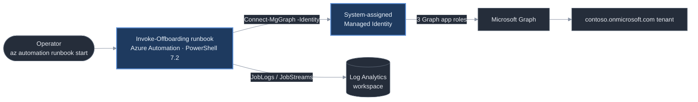

# M365 Identity Offboarding Automator

> Turns a multi-step, error-prone employee offboarding checklist into one auditable, logged automation run.

[](https://github.com/realitylvn/m365-offboarding-automator/actions/workflows/ci.yml)


## The problem

When someone leaves, their access doesn't. The account stays enabled, the sign-in
sessions stay live, the licences keep billing, and the group memberships keep
granting whatever they granted. The list of things to undo is well known and
almost always done by hand — a person working through a checklist in the admin
portal, tab by tab, hoping they didn't miss one. Miss the session revocation and
a departed employee keeps working access for hours. Miss a licence and it bills
until someone notices. Miss a group and it's a standing hole nobody audits.

This is the smallest useful version of the fix: one runbook that takes a user's
UPN, does the four highest-value steps in a fixed order, and writes down exactly
what it did and what it couldn't.

## What it does

- Runs **on demand** — an operator starts a job with one parameter, the target
  user's UPN. No schedule, no state between runs.
- Authenticates to Microsoft Graph as the Automation Account's **system-assigned
  Managed Identity** (`Connect-MgGraph -Identity`) — no secret anywhere.
- Runs four **independently-wrapped, partial-completion-tolerant** steps:
  1. **Disable the account** (`accountEnabled = false`) — no-op if already disabled.
  2. **Revoke all sign-in sessions** — invalidates every refresh token.
  3. **Remove all direct licence assignments** in a single `Set-MgUserLicense` call.
  4. **Remove all manually-assigned group memberships** — dynamic (rule-based)
     groups are detected and skipped with a logged warning, never attempted.
- A failure in one step is caught, recorded as `failed` for that step, and the
  run **continues** — no step aborts the others.
- Job output is a **JSON summary**: `succeeded` / `failed` / `skipped` / `noop`
  counts plus a per-step breakdown. Per-step `[timestamp] LEVEL message` logs go
  to the Information stream, and Automation diagnostic settings route `JobLogs` +
  `JobStreams` to a Log Analytics workspace.

## Architecture

See [`docs/architecture.md`](docs/architecture.md) for the diagram and the full
write-up. In short:



**Services used:** Azure Automation (PowerShell 7.2 runtime), Microsoft Graph
PowerShell SDK, Log Analytics, Bicep, Azure Developer CLI (`azd`), GitHub Actions.

**Auth:** the Automation Account's system-assigned Managed Identity holds three
Graph application permissions (`User.ReadWrite.All`, `GroupMember.ReadWrite.All`,
`Organization.Read.All`) by direct app-role assignment — no app registration, no
certificate, no secret anywhere.

## Environment

Built and tested against a **real Microsoft 365 tenant** with synthetic test
users (`offboard-test-1..3@contoso.com`) created by
`scripts/create-test-users.ps1`. The tenant, the Graph calls, and the permission
changes are all real — the accounts are purpose-built stand-ins, never real
personnel. Every user, group, and SKU id in this repo's fixtures and
[`docs/sample-run.json`](docs/sample-run.json) is either synthetic or replaced
with a stable placeholder.

## What this doesn't do

Deliberate scope boundaries, not oversights:

- **No mailbox-to-shared-mailbox conversion** — a common real offboarding step,
  out of scope here (needs Exchange Online, a different permission surface).
- **No dynamic-group removal** — rule-based memberships are skipped with a
  warning; changing them means editing the rule, not the user.
- **No group-based (inherited) licence removal** — only direct assignments are
  removed; an inherited licence surfaces as a `failed` step and the run
  continues.
- **No undo** — there is no reversal run. Re-enabling is manual.
- **No scheduling and no HR/ticketing integration** — the trigger is a human
  starting a job with a UPN.
- **No OIDC deploy pipeline** — CI runs lint + tests + `bicep build` on every PR,
  but provisioning is done by hand with `azd`. The reasoning (and what a
  correctly-scoped version would need) is in [`REVIEW.md`](REVIEW.md).

## Running it yourself

```bash
# 1. Provision the Automation Account, Log Analytics workspace, Graph modules,
#    and the runbook resource. The postprovision hook publishes the runbook.
azd auth login
azd env new offboarding-dev            # sets AZURE_ENV_NAME / AZURE_LOCATION
azd provision

# 2. One-time: create synthetic test users + the demo group in your tenant
#    (interactive Graph consent on first run).
pwsh ./scripts/create-test-users.ps1

# 3. Global Admin session: grant the Automation Account's managed identity its
#    three Graph application app-roles (admin-consent equivalent). Idempotent —
#    run it to arm the identity before a run, revoke after (see Operating posture).
pwsh ./scripts/grant-managed-identity-graph-permissions.ps1 `
  -AutomationAccountName aa-offboarding-dev -ResourceGroupName rg-offboarding-dev

# 4. Run an offboarding job.
az automation runbook start `
  --resource-group rg-offboarding-dev `
  --automation-account-name aa-offboarding-dev `
  --name Invoke-Offboarding `
  --parameters TargetUpn=offboard-test-1@contoso.com

# 5. Regenerate the dashboard snapshot from the job's JSON summary, then commit
#    the updated status.json. The Ops Command Center dashboard fetches this file
#    from raw.githubusercontent.com (cadence: on-demand, never stale on age).
pwsh ./scripts/Build-StatusJson.ps1 -RunSummaryPath <the job's summary JSON>
```

Local checks before a PR: `pwsh ./runbook/tests/Invoke-Pester.ps1` (unit +
orchestration tests) and
`Invoke-ScriptAnalyzer -Path runbook/Invoke-Offboarding.ps1 -Settings ./PSScriptAnalyzerSettings.psd1`.

## Operating posture

`rg-offboarding-dev` stays provisioned (Free SKU, $0/mo), but the managed
identity's three Graph application permissions are **granted only while the tool
is in active use and revoked when it's idle** — a runbook that runs a handful of
times a year shouldn't hold standing, promptless read/write over every user and
group membership in the tenant. Arming and revoking are each one idempotent
script run. Same reasoning as the deliberately-deferred OIDC deploy pipeline: a
privilege is held for a task, not "just in case." Details in
[`REVIEW.md`](REVIEW.md).

## Sample output

[`docs/sample-run.json`](docs/sample-run.json) — real job output over the
synthetic accounts, GUIDs replaced with placeholders. Four runs: two full
offboards, a missing-UPN clean failure (`resolve-user` failed, zero step
attempts, `completed_with_failures`), and an idempotent re-run of an
already-offboarded user (`disable` → `noop`, `remove-licenses` → `noop`,
`remove-group-memberships` → `skipped`).

[`status.json`](status.json) — the current-state snapshot the
[Ops Command Center](https://github.com/realitylvn/azure-ops-command-center)
dashboard reads, to the shared portfolio schema. This project has no storage
account, so the file is committed and regenerated by
[`scripts/Build-StatusJson.ps1`](scripts/Build-StatusJson.ps1) after a job run
(step 5 above). `cadence: on-demand` — `completed` maps to `ok`,
`completed_with_failures` to `error`; there is no `finding` state.

## Cost

The Automation Account runs on the **Free** SKU (500 job-minutes/month included;
each offboarding job is seconds). The Log Analytics workspace is capped at 1
GB/day and holds only job logs. **Effective monthly cost: $0.**

## Built with

Designed and reviewed with Claude (architecture, spec-tightening, this README),
implemented with Claude Code and the Azure CLI in VS Code. [`REVIEW.md`](REVIEW.md)
is the running build log — every decision, every `az`/`azd`/Graph command, the
platform quirks, and the AZ-900 / AZ-104 domain mapping.

---

## Portfolio series

A five-project Azure/M365 portfolio, built in order:

1. [azure-cost-sentinel](https://github.com/realitylvn/azure-cost-sentinel) — flags anomalous subscription spend in plain English
2. [m365-offboarding-automator](https://github.com/realitylvn/m365-offboarding-automator) — runs the Microsoft 365 leaver checklist via the Graph API *(you are here)*
3. [azure-drift-detector](https://github.com/realitylvn/azure-drift-detector) — alerts when live resource config drifts from a reference
4. [azure-nsg-scanner](https://github.com/realitylvn/azure-nsg-scanner) — finds NSG rules open to the internet, subscription-wide
5. [azure-ops-command-center](https://github.com/realitylvn/azure-ops-command-center) — one live status view over all four
