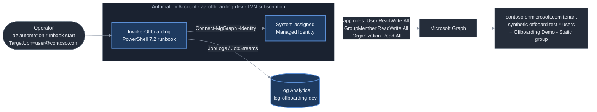

# Architecture

## One tenant, not two

The original spec assumed a cross-tenant setup: a Microsoft 365 Developer Program
tenant holding the identities to offboard, and the LVN Azure subscription holding
the compute — which would have needed an app registration with a certificate
credential to bridge them. `az account show` settled it: the LVN Azure
subscription's home tenant (`<TENANT_ID>`) **is** the
contoso.onmicrosoft.com Microsoft 365 tenant. One tenant, one subscription, no bridge
needed. (The free M365 Developer Program sandbox is also gated to Visual Studio
subscribers now and wasn't available anyway.)

## Managed Identity + app-role assignment, no credential

Because compute and identities live in the same tenant, the Automation Account's
own **system-assigned Managed Identity** does the work. A one-time script
(`scripts/grant-managed-identity-graph-permissions.ps1`, run under a Global
Administrator session) grants that identity's service principal exactly three
Microsoft Graph **application** permissions by direct app-role assignment — the
admin-consent equivalent. The runbook then authenticates with
`Connect-MgGraph -Identity`. There is no app registration, no certificate, and no
client secret anywhere in source, Bicep, Automation variables, or CI. The
permission set is a hard ceiling of three: `User.ReadWrite.All` (disable +
revoke sessions), `GroupMember.ReadWrite.All` (remove manual memberships),
`Organization.Read.All` (read tenant SKUs for the licence step).

## Stateless, on-demand, logged

There is no database and no schedule. An operator starts a job with a target
UPN; the runbook resolves the user, then runs four independently-wrapped steps —
disable account, revoke sign-in sessions, remove licence assignments, remove
manual group memberships (dynamic groups are detected and skipped with a
warning). A failure in one step is caught, recorded as `failed` for that step,
and the run continues. The job's output is a single JSON summary
(`succeeded` / `failed` / `skipped` / `noop` per step); the per-step
`[timestamp] LEVEL message` log lines go to the Information stream. Automation
diagnostic settings route `JobLogs` and `JobStreams` to the
`log-offboarding-dev` Log Analytics workspace so every run is queryable after the
fact. See [`sample-run.json`](sample-run.json) for real output over the synthetic
test accounts.
